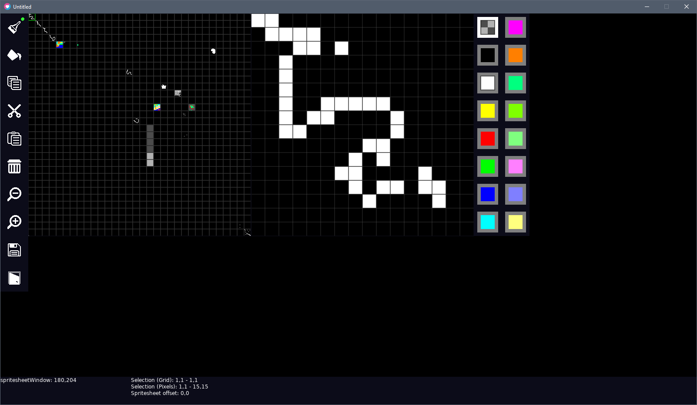

# Sprite Maker

# Currently Implemented
- 16x16 sprite editor
- 16 Configurable Colours
- Brush and Fill (fill not impl. yet)
- Spritesheet zoom in/out
- Copy, Cut, Delete, Paste (paste not impl. yet)
- Save to PNG and JSON (in Love default save location)

#What isn't implemented
- Fill and paste :)
- Mapper / Tiler using the spritesheet
- Animation naming and frame selection
- Copied sprite indicator (like the brush indicator) and selection preview

